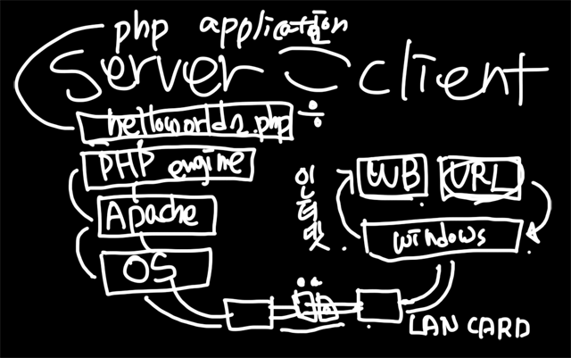
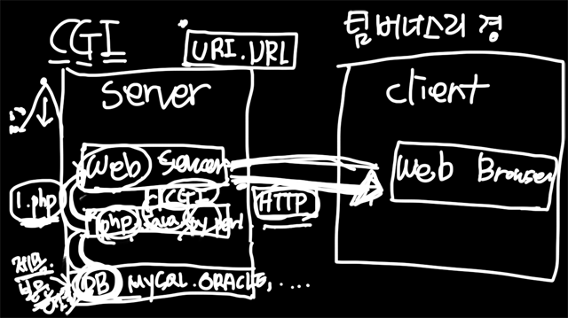

## 1. Windows 에서 PHP 설치하기

- W APM: Window Apach PHP MySQL
- Bitnami를 통해 W APM 설치 쉽게 가능
- httpd.conf 파일을 열어보면 DocumentRoot를 확인할 수 있음
- DocumentRoot "C:/Bitnami/wampstack-7.1.26-0/apache2/htdocs"


## 2. Windows에서 PHP 설정하기

#### 2-1. 설정이란

Configuration. PHP가 동작하는 기본적인 작동방법을 변경하는 것으로, php.ini 파일를 통해서 변경 사항을 반영할 수 있다. 설정을 변경 한 후에는 웹서버를 리로드(reload) 혹은 재시작(restart) 해야 한다.

#### 2-2. 에러설정

에러는 개발이나 오류를 파악하는데 중요한 수단이지만, 에러가 실서버 환경에서 그대로 노출되는 것은 바람직하지 못하다. 아래는 실서비스와 개발환경에서의 권장 설정 방법이다. 

C:\BitNami\wampstack-5.4.20-0\php\php.ini

#### 2-3. 운영 

```
display_errors = Off
display_startup_errors = Off
error_reporting= E_ALL
log_errors = On
```

#### 2-4. 개발

```
display_errors = On
display_startup_errors = On
error_reporting = -1
log_errors = On
```

php.ini: PHP에 대한 기본적인 설정을 저장한 파일

- 개발 환경의 경우, php.ini-development 파일을 php.ini로 수정
- 배포 환경의 경우, php.ini_production 파일을 php.ini로 수정

설정 변경 후, Bitnami 웹 서버를 다시 켜 줄 것.


## 3. 나의 첫번째 PHP 어플리케이션

- /firstapp/helloworld.php 

```php
<?php
echo "Hello world";
?>
```

- /firstapp/helloworld2.php
  - `<?php> <?>` : PHP Interpreter/Engine은 해당 기호안에 있는 내용만 php로 해석함 

```html
<html>
<body>
echo "Hello world";    
<?php
echo "Hello world";
?>
</body>
</html>
```

- 그림 설명

  




## 서버측 언어를 사용하는 이유

- HTTP:  웹 브라우저와 웹 서버가 서로 데이터를 주고 받기 위한 통신 규약
- CGI: 웹서버와 서버 사이드 스크립트가 서로 데이터를 주고 받기 위한 통신 규약

웹브라우저가 요청한 페이지(자원)이 HTML이 아닌 경우 웹 서버는 처리가 불가능함. 따라서 처리 가능한 적합한 언어의 엔진을 호출하여 사용자가 요청한 파일의 처리를 위임함. PHP, PYTHON 등이 파일을 읽어서 각각의 언어(코드)를 해석한 다음 그 결과를 웹서버에 돌려줌.  (CGI에 의해 약속된 방식에 따라)

추가로, 서버사이드 스크립트는 경우에 따라 데이터베이스에 접근하여 데이터를 HTML 문서로 변경한 다음 웹서버로 데이터를 전달함.




