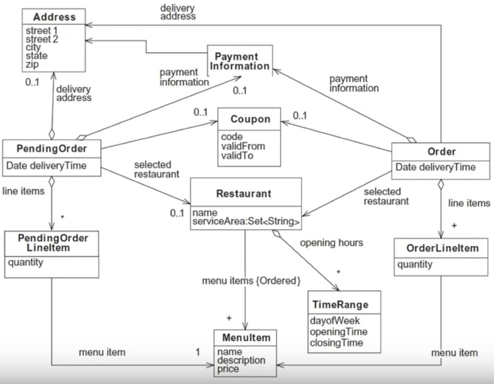

> 백명석님의 클린코드 [강의](https://www.youtube.com/playlist?list=PLuLb6MC4SOvXCRePHrb4e-EYadjZ9KHyH) 를 듣고 정리한 포스팅 입니다.

#### 1. 데이터(정적) 모델링 
>  클래스, 속성, 관계 식별

- 도메인 영역의 주요 개념(명사)를 식별. 요구사항에 있는 명사를 식별한다.
- "Applying UML and Patterns" 참조 
- 초기 도메인 모델의 예시 - 클래스, 멤버변수, 관계만 명시되어 있음
	- 정적 모델링 - 모든 사람들이 공유 할 수있게 청사진을 그림

테스트

테스트22

ㅇㅇㅇㅇ

#### 2. 행위 모델링

>  도메인 모델에 행위 추가하기

- 도메인 모델에 행위를 추가함으로써 도메인 모델에 생명력을 부여
- 도메인 모델의 행위를 결정하기 위해 도메인 모델의 책임(Responsibility)와 상호작용(Collaboration)을 식별
  - 클래스의 책임 - 클래스가 아는것(속성, 관계), 하는 것, 결정 하는 것 등
  - 클래스의 상호작용 - 책임 수행을 위해 호출하는 다른 클래스들
- 책임과 상호작용을 식별하는 절차
  - 요구사항(유스케이스, 유저스토리, UI 디자인) 분석을 통해 어플리케이션이 처리해야 하는 요구사항 식별
  - 도메인 모델의 클라이언트(Presentation layer 등)에게 도메인 모델을 노출하기 위한 도메인 모델의 인터페이스(타입, 메소드) 결정 - 서비스의 인터페이스
  - 해당 인터페이스를 각각의 요구사항을 고려하여 TDD 접근법으로 구현

#### 2-1. 요구사항 식별하기

- 처리해야할 요구사항을 식별/어떻게 응답할 지 결정
- UI 디자인, 유스 케이스, 유저 스토리 등을 분석한다
- 요구사항은 2가지 부분으로 구성
  - 사용자 행위, 요청  ex) 고객이 배송 정보를 입력한다.
  - 사용자 행위, 요청에 대한 어플리케이션의 응답 - 유스케이스의 책임 ex) 배송 시간을 검증하고 배송 정보를 갱신
- 어플리케이션의 책임은 2가지로 그룹핑
  - 사용자 입력 검증(validate), 값 계산(calculate), 데이터베이스 갱신(update)
  - 값 출력 (화면에 뿌릴 값을 제공하는 기능)
  - Command Query Seperation

#### 2-2. 메소드 식별하기
>  각 요청에 대해 2가지 메소드 들이 존재

- 서비스 메소드
  - 사용자 요청 검증
  - 계산 수행
  - 데이터 베이스 갱신
- 리파지토리 메소드
  
  - 출력을 위한 데이터 반환
- 도메인 모델의 클라이언트는 도메인 티어를 2번 호출
  - 서비스 메소드 + 리파지토리 메소드
  
  
#### 2-3. TDD로 메소드 구현하기

- 대상 서비스 메소드에 대해 하나 이상의 테스트 케이스(다양한 argument에 대해 서비스가 잘도는지)를 작성하는 것으로 시작. 각 테스트 케이스는 서로 다른 상황을 재현하기 위해 다른 인자로 구성된다.
- Mock 객체를 이용해서 ➔ 서비스 메소드 ➔ 리파지토리 메소드 순으로 top-down 방식으로 구현
- 구현을 하다가 발견되는 collaborator를 구현하기 위해 머릿속에서 context-switching이 일어날 필요가 없어서 집중하면서 구현