> 백명석님의 클린코드 [강의](https://www.youtube.com/playlist?list=PLuLb6MC4SOvXCRePHrb4e-EYadjZ9KHyH) 를 듣고 정리한 포스팅 입니다.


#### 1. Architecture

- Web 기반 Accounting 시스템이 있다고 가정할 때, 아키텍처에서 주목해야할 부분은 Web 시스템이 아니라 Accounting 시스템이어야 함.
- SW 아키텍처는 Accounting Issue를 잘 드러내야 하며, Web에 대한 Issue는 거의 언급되지 않아야 함.
- 하지만 대개의 웹 시스템은 반대임. Web Issue에 대해 고함치며, 비즈니스 의도에 대해서는 거의 언급하지 않음.


#### 1-1. Web System에 만연하는 MVC Architecture

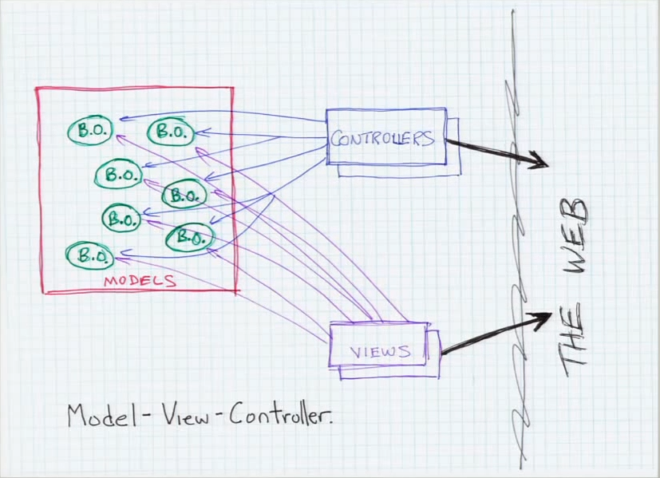

- View/Controller: 강하게 HTML과 연관
- Model: 강하게 Controller에 연관
- View/Controller: 강하게 모델에 coupling. 모델의 구조에 많은 영향을 미침.


#### 1-2. Accounting System Architecture

- 아키텍처 변경 없이 delivery 매커니즘을 변경할 수 있어야 함.
- 동일한 시스템을 웹과 콘솔에 delivery 할 수 있어야 함.
- 이 두 시스템의 아키텍처는 동일해야함.


#### 2. Use Cases

> "Object-Oriented Software Engineering - A Use Case Driven approach", Ivar Jacobson

- Delivery 문제를 우아한 아키텍처로 해결
- Delivery와 무관한 방식으로 사용자가 시스템과 상호작용하는 방식을 이해하는 것
- 링크, 버튼, 클릭 등의 용어를 사용하지 않고 표현
- Delivery 매커니즘을 나타내지 않는 용어로 사용
- 제이콥슨은 이런 상호작용을 **use case**라고 했음.
- 어플리케이션 개발은 Delivery와 독립적인 Use Case에 의해 주도되어야 한다. 이를 통해 다양한 Delivery 매커니즘을 수행할 수 있음.
  - 다양한 Delivery 매커니즘을 쓰지 않는 경우(웹만 쓰는 경우)라도, 딜리버리 매커니즘과 잘 절연이 되어야, 웹에서 변경이 일어나더라도 어플리케이션이 보호가 됨.
- use case가 시스템에서 가장 중요한 것


#### 3. Use Case Driven Architecture

- use case driven 시스템의 아키텍처를 보면 delivery 매커니즘이 아닌 use case를 보게 됨
  - 독자가 보게 되는 것은 **시스템의 의도**이다.
- `TimeCardTransaction` : 유즈 케이스를 추상화한 클래스
- `TimeCardTransaction` 라는 행위가 있음.
  - 직원이 출근하여 `TimeCard`를 찍었을 때 일어나는 행위. 
  - 그 어플리케이션 로직을 구현한 것이 `TimeCardTransaction`
  - `TimeCard`  & `Employee` 와 같은 Entity(도메인 모델)과도 상호작용을 함

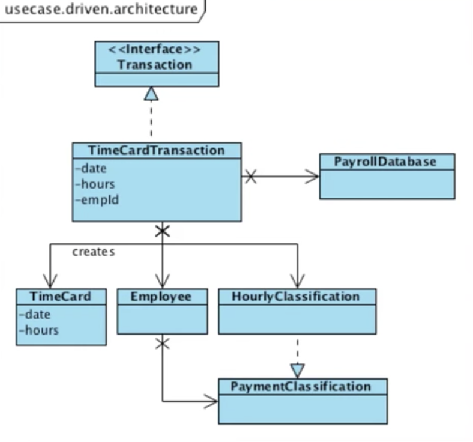


#### 4. Use Cases

- 사용자가 특정 목적을 이루기 위해 시스템과 어떻게 상호작용하는지에 대한 형식적 기술
- 목적: 주문 처리 시스템에서 새로운 주문을 생성하는것

```bash
Create Order
Data:
	<customer-id>, <customer-contact-info>, <shipment-destination>, 
	<shipment-mechanism>, <payment-information>
Primary Course:
1. 수주 담당자가 위의 데이터를 가지고 "create order" 커맨드를 실행시킨다.
2. 시스템은 모든 데이터를 검증한다.
3. 시스템은 주문을 생성하고 주문 아이디를 결정한다.
4. 시스템은 주문 아이디를 수주 담당자에게 전달한다.
```

- screen, button, field등과 같은 웹(Delivery 매커니즘)과 같은 것들은 언급하지 않음
- 시스템으로 들어가는 데이터, 커맨드와 시스템이 응답하는 것만 언급
- Delivery 매커니즘과 무관한 아키텍처를 가지려면 Delivery 매커니즘과 무관한 use case로 시작해야 한다
- Use case의 응답도 주목
  - Create order에서 Response가 order_id라고 가정했을 때, 
  - order_id는 완전하게 Delivery 매커니즘과 무관, 수주 담당자는 order_id를 볼 필요가 없음
  - 반면 delivery 매커니즘은 팝업을 띄워서 사용자에게 항목을 주문에 추가하라고 요청할 수 있음
- Use Case는 입력 데이터를 해석하여 출력 데이터를 생성하는 필수 알고리즘
- Use Case를 구현하는 객체를 생성할 수 있다는 것을 의미함.
- 이 예제는 primary course만 있는데 예외상황도 있을 수 있음.

  

#### 4-1. Use Case Alogrithm

- Use Case Alogrithm은 다른 비즈니스 객체들(Customer, Order)을 언급(내포)함
- 알고리즘: use case 정의. 비즈니스 규칙을 내포
- 하지만 이런 비즈니스 규칙은 customer나 order 객체에 속하지 않는다.
  - create order 하기 위해서는 customer_id가 있어야 함.
  - order을 하기 위한 상품의 코드, 갯수를 알아야 함.
  - 그런데 고객은 이러한 것을 다 할 수 있는가? customer은 상품에 대해 모름. order은 상품에 대해서는 알지만 customer에 대해서는 모름. 알수 없음. 한 객체에게 줄 수 없는 책임.
- 여러 객체들을 coordination 하는 규칙을 어디에 위치할 것인가(어디에 비즈니스 규칙을 내포시킬 것인가)? 
  - Use Case 객체에 비즈니스 규칙을 위치시켜야한다.
  - 이렇게 partitioning을 하게 되면 아키텍쳐에서 use case가 가장 핵심적인 역할을 하게 될 것이다.


#### 5. Partitioning - 어떻게 나눌 것인가?

> Ivar Jacobson: 아키텍처는 3개의 fundamental kinds of objects를 갖는다

- Business Objects - **Entities** 
  - Entity, VO
- UI Objects - **Boundaries**
  - DTO, VO
- Use Case Objects -  **Interactors**
  - Controller라고 야콥슨이 부름. 그러나 MVC와 혼동을 피하기 위해 Interactors라고 부름


#### 5-1. Entities

- 주문이라는 도메인을 만든다고 하면, 주문이라는 도메인에는 어디에나 "Order", "Product"라는 클래스가 있을 것임. 그런데, A라는 회사의 주문시스템과  B라는 회사의 주문시스템은 다를 것임. (로직의 처리가 다름)
  - 같은 도메인인데 어떠한 시스템이냐에 따라 달라지는 부분을 어플리케이션 로직이라고 할 수 있음.
  - 도메인이 같으면 무조건 같은 로직을 비즈니스 로직, 도메인 로직이라고 할 수 있음.
- 엔티티는 어플리케이션 로직을 갖지 않으며, 독립적인 비즈니스 로직을 갖는다. 
- 다른 어플리케이션에서도 그 엔티티를 사용할 수 있음.
- 어플리케이션의 특화된 메소드는 엔티티가 가지고 있으면 안됨. 이런 메소드는 Use Case Object(Interactor)로 옮겨야 한다.
- Book, Library, Employee


#### 5-2. Interactor (Service, UseCase)

- 어플리케이션에 종속적인 업무 규칙 (비즈니스 로직)을 갖고 있음
- 특정 어플리케이션에 특화된 메소드들은 Interactor 객체에 구현
- Interactor는 application에 특화된 로직을 통해 목적을 달성
  - Application과 무관한 entity 로직을 호출
    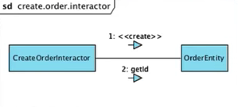
  - 예) CreateOrderInteractor: OrderEntity에 create 하고, GetId를 호출. 이러한 로직은 이 어플리케이션에서만 수행하며 다른데서는 안할 수 도 있음(이 두 메소드는 application 로직과 무관)
  - Use Case의 목적을 달성하기 위해 이러한 메소드들을 어떻게 호출하는지 아는 것이 Interactor의 책임이다.


#### 5-3. Boundary Object (DTO)

> Use Case의 책임 중 하나는 사용자로부터 입력을 받고, 결과를 다시 사용자에게 반환하는 것. 이를 위해 또다른 객체가 존재하며 이것이 바로 Boundary Object

- Use Case를 딜리버리 매커니즘으로부터 분리할 때 사용
- Use Case를 Delivery 매커니즘 간의 통신 수단 제공
- 여러가지 클라이언트(MVC / Console / Thick Client Boundary) 등은 Boundary의 반대편에 존재
- Use Case는 이러한 Delivery 매커니즘에 대해 모른 채 Boundary의 또다른 반대편에 존재


#### 5-4. Flow

- Delivery 매커니즘 
  - 사용자 요청 수입
- 요청을 표준적인 형식(Request Model)으로 표현. RequestModel은 Object가 아니며 Data Structure 임. (Getter, setter만 있으면 됨)
  - Boundary를 통해 RequestModel을 Interactor에 전달
- Interactors(Use case)
  - Applications에 특화된 비즈니스 로직을 수행
  - Entity를 조작하여 Application에 독립적인 비즈니스 로직을 수행(Validate, calculate, update)
- Interactor(Use Case)
  - 결과를 수집
  - 표준적인 형식(Response Model)로 생성
  - Boundary를 통해 다시 Delivery 매커니즘으로 전달

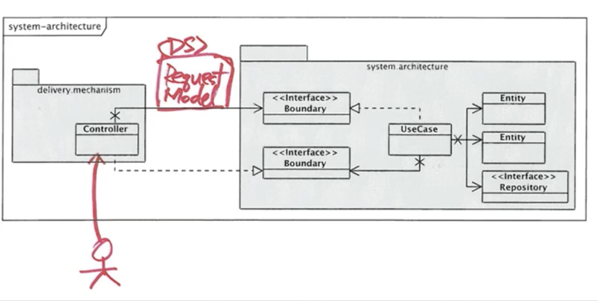

*"정해진 Flow는 없으며 단지 관계만 있을 뿐임."*

1. Request & Response Model은 순수한 데이터 구조이다.
2. Boundary(Interface, DTO)를 통해서 Request Model이 Interactor(Use Case)로 전달됨.
   - 1 Interactor per a Use Case ( 1 Interactor == CreateOrderUseCase)
3. Interactor은 정해진 Use Case에 따라 기능을 수행함
4. Interactor은 관련된 Entity를 사용해 무언가를 수행하고 결과를 수집
5. 수행 결과를 Response Model로 변환해 Boudary를 통해 외부로 전달함

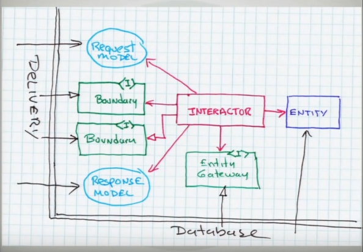


#### 5-5. Use Cases and Partitioning

- 우리는 시스템의 행위를 use case로 기술한다.
  - use case에서 application에 특화된 행위를 interactor 객체로 캡쳐한다.
  - application에 무관한 행위를 entity 객체로 캡쳐하고 interactor로 제어한다.
  - UI 종속적인 행위는 boundary 객체로 캡쳐하여 interactor와 커뮤니케이션한다.


#### 6. Isolataion

- 소스 코드 의존성은 하나의 방향만 유지해야함(Delivery 매커니즘을 Decouple하기 위해)


#### 7. Database

- 비즈니스 객체가 아니라 Data Structure를 포함
- 데이터가 저장되는 방식은 Interactor나 Entity가 원하는 방식이 아님
- 그러므로 DB와 Entity간의 Boundary Layer를 제공해야 함 (Dependency Inversion Principle)

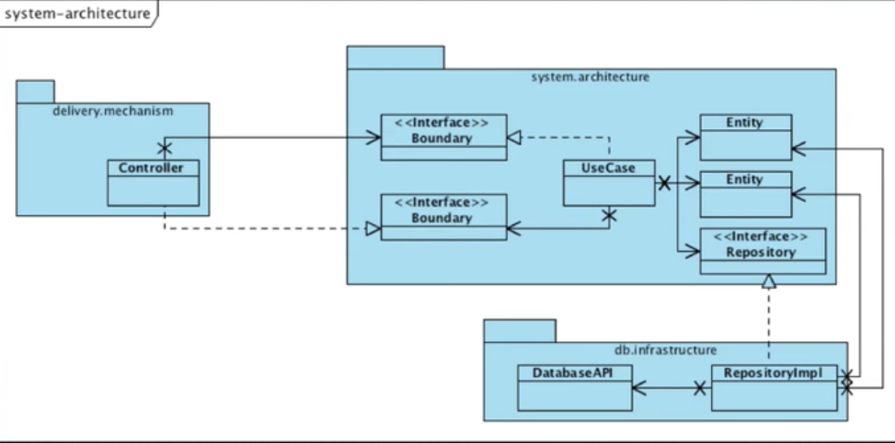


#### 8. Conclusion

- 아키텍쳐는 툴이나 프레임워크에 기반하지 않는다
- 좋은 아키텍쳐
  - 툴이나 프레임워크에 대한 결정을 아주 오랫동안 미룰 수 있음
  - 이행되지 않은 결정의 갯수를 최대화
  - 딜리버리 매커니즘에 의존하지 않고 노출시키지 않고 숨김
- 시스템의 모양을 보면 web 시스템인지 여부를 알 수 없어야 함
- 시스템의 use case는 주요한 추상화(primary abstraction)이고 시스템 아키텍처를 구성하는 핵심적인 원칙
- 아키텍처를 보면 UI가 아니라 시스템의 의도를 볼수 있어야함.
- Interactor는 use case를 캡슐화(구현)하고 entity는 비즈니스 객체를 캡슐화하며 boundary는 UI와 격리를 제공
- 격리를 얻기 위해 application을 delivery 측과 분리하는 boundary 인터페이스 생성


#### 9. Web Server의 Reuqest 처리 과정

> [JustWrite](https://medium.com/@younghyun/%ED%81%B4%EB%A6%B0-%EC%95%84%ED%82%A4%ED%85%8D%EC%B2%98-by-%EC%97%89%ED%81%B4-%EB%B0%A5-a6a917ff6afc) 님의 블로그 포스팅의 이미지를 참조하였습니다.

##### 기본 구조

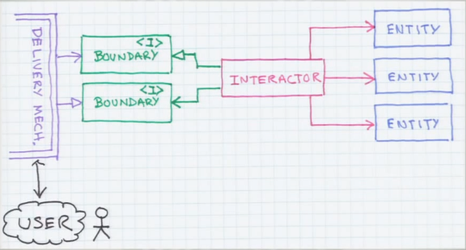

##### 사용자가 Delivery Mechanism을 통해 요청을 전달

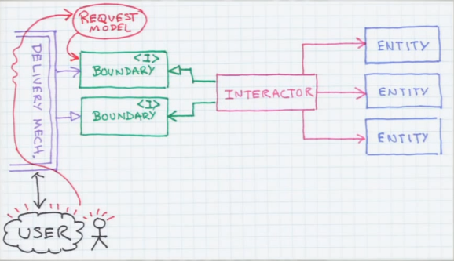

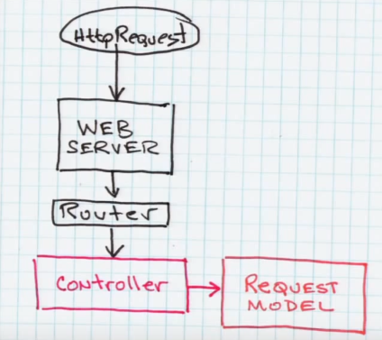

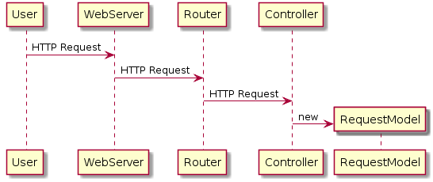

##### 컨트롤러가 Request Model을 Interactor(Use Case)에 전달

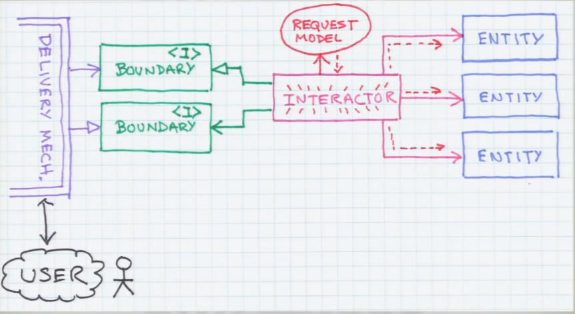

##### Interactor가 Boundary 인터페이스를 구현함. Delivery Mechanism에서는 Boundary 인터페이스를 통해 Interactor를 호출함.

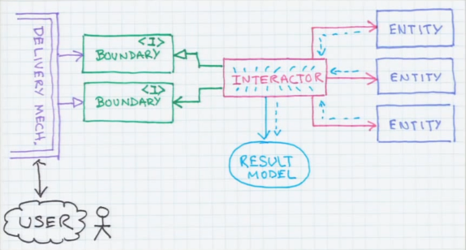

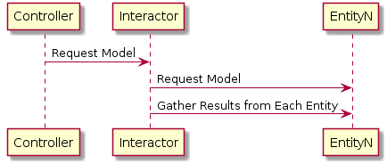

##### Interactor가 수행 결과를 Delivery Mechanism에 반환

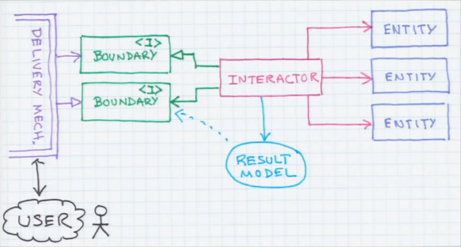

##### Delivery Mechanism의 어떤 객체가 Boundary 인터페이스를 구현함. Interactor는 이 Boundary 인터페이스를 통해 결과를 전달함.

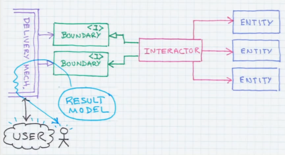

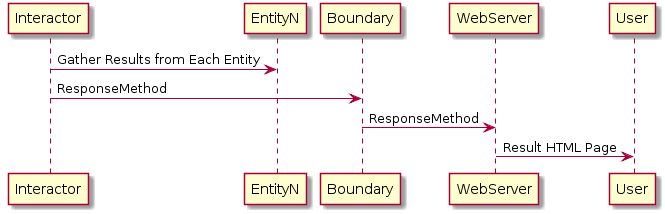


> 결과적으로 Delivery Mechanism에 해당하는 Web Server는 어플리케이션 핵심인 Interactor를 알지 못함. 이로 인해 얻을 수 있는 점은 Delivery Mechanism이 Easy to Plug In/Out 될 수 있다는 것임.

