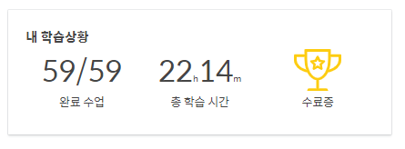
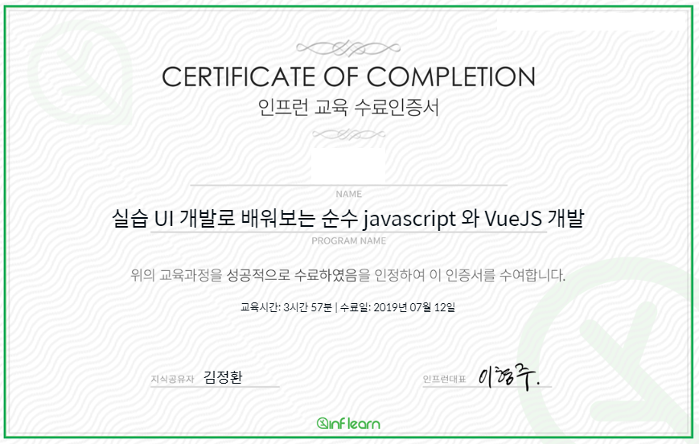

#### 2019-07-08

- 김정환 개발자님의  [실습 UI 개발로 배워보는 순수 javascript 와 VueJs 개발]([https://www.inflearn.com/course/%EC%88%9C%EC%88%98js-vuejs-%EA%B0%9C%EB%B0%9C-%EA%B0%95%EC%A2%8C/dashboard](https://www.inflearn.com/course/순수js-vuejs-개발-강좌/dashboard)) 강의가 드디어 Vue.js 파트로 넘어왔다. 순수 자바스크립트 코드로 MVC 패턴에 따라 진행했던 방식을 처음 접하기도하고 익숙하지 않아 이해하는게 쉽지 않았는데, 같은 기능을 Vue.js로 다시 구현해보니 Vue의 위대함을 알 수 있었다. 
- Vue의 MVVM 패턴이 너무 직관적이고 쉽다!

#### 2019-07-09

- 인프런 강의의 Vue.js 파트를 마무리 지었다. Vue 기반의 MVVM 패턴으로 기능을 구현하는 방식이 크게 어렵지 않았고,  간단한 디렉티브등을 사용했던지라 빠르게 강의를 마무리 지을 수 있었던 것 같다.
- 방과 후에 듣는 인프런 강의 외에, 주중에는 수업시간을 통해 팀 프로젝트를 진행 중에 있다. 자세한 내용을 언급하긴 어렵지만, 현재 Firebase를 통해  사용자 인증(회원가입, 로그인) 기능을 구현중에 있다. 
- 예전부터 AWS나 Firebase 등 서버사이드의 많은 기능을 제공하는 플랫폼을 한번 경험해보고 싶었기에, 파이어베이스 관련 기능을 지원했는데, 특히 Firebase는 안드로이드 등 모바일 플랫폼에서 많이 쓰이는지, 웹 개발쪽은 검색 결과가 썩 시원찮다.
- 덕분에 공식문서를 가지고 하나하나 코드를 살펴보고 있는데,  빅스비 개발을 해봤던 경험이 많은 도움이 되고 있다! 

#### 2019-07-10

- 강의가 마지막 파트인 "컴포넌트로 기능 구현"에 다달았다. 
- Vue에서는 마치 객체 지향 프로그래밍 처럼, 각 기능 또는 화면의 구조 등을 컴포넌트로 구분하여, 필요할 때, 그 컴포넌트를 불러와 손쉽게 사용하는 방법을 제공하고 있다.
- 사실 현재로써는 HTML + JS 파일로 구성된 일반적인 Vue 방식이 더 익숙하고 직관적으로 이해하기 쉽긴 하지만, 프로젝트의 규모가 커진다면, traceability나 코드의 생산성을 고려해볼 때, component  방식의 프로젝트 구현이 훨씬 더 많은 도움이 될 것 같긴 하다.
- 상위 & 하위 컴포넌트간의 데이터를 교환할 때 특별한 기능을 사용하는데, 그 쓰임새는 다음과 같다.
  - `props` : 상위 -> 하위 컴포넌트로 데이터 전달
  - `$emit` : 하위 -> 상위 컴포넌트로 데이터 전달

#### 2019-07-11

- 컴포넌트 파트 강의 수강 완료. 정말 마지막인 Single File Component  파트만 남았다.
- 프로젝트를 진행하면서 vuex 라는 녀석을 알게 되었다.  특정 변수를 컴포넌트와 관계없이 전역변수로 저장시켜 어디서든 쉽게 불러 올 수 있게 하는 상태관리 라이브러리 인데, store.js 라는 파일에서 코드를 작성한다.
- 처음에는 왜 굳이 불필요하고 복잡하게 따로 vuex 라는 것을 사용하는 지 몰랐는데, 만약 최상위 컴포넌트에서 몇차례를 걸친 최히위 컴포넌트간의 데이터를 주고 받는다고 가정할 때, 얼마나 복잡하게 props & $emit 등을 통해 코드를 작성해야하는지를 생각해보면, vuex가 제공하는 기능의 편리함을 알 수 있을 듯 하다.
- mutations, actions, commit, payload 등 겉핥기식으로 우선 코드를 살펴보았는데, 조만간 vuex에 대해 상세히 공부를 해봐야겠다.

#### 2019-07-12

- 김정환 개발자님의  [실습 UI 개발로 배워보는 순수 javascript 와 VueJs 개발]([https://www.inflearn.com/course/%EC%88%9C%EC%88%98js-vuejs-%EA%B0%9C%EB%B0%9C-%EA%B0%95%EC%A2%8C/dashboard](https://www.inflearn.com/course/순수js-vuejs-개발-강좌/dashboard)) 강의를 드디어 수강 완료하였다.

- 4시간짜리 강의를 2~3일만 집중해서 들으면 금방 들을 줄 알았던 4시간 짜리 강의를 무려 22시간 동안이나 듣게될 줄은 몰랐다..! 

- 동일한 기능을 순수 자바스크립트 -> vue -> 컴포넌트 -> 단일 컴포넌트 식으로 단계별로 기능을 구현하면서 단계별 차이점을 한눈에 쉽게 알 수 있었던 점이 인상깊었고, 또한 실습 위주로 진행되어 더 집중을 할 수 있었던 것 같다. 

- 바닐라 JS & MVC 패턴이 익숙하지 않아 이 파트에서 거의 12시간 가까이를 사용했는데, 조만간 미니프로젝트나 강의를 빠르게 복기하면서 다시한번 코드를 살펴봐야겠다.

- 인프런에서 강의를 완료하니 수료인증서도 주더라!

  

  

#### 2019-07-14

- 김정환 개발자님의 강의에 이어서, Vue JS의 다른 강의를 듣고 싶어 검색을 하다가 Udemy에서 VUE JS 2 - The Complete Guide 라는 [강의](<https://www.udemy.com/vuejs-2-the-complete-guide/>)를 알게 되었다. 이 강의랑 파이어베이스를 함께 활용하여 Vue JS를 가르치는 다른 강의 중 고민을 하다가, 이 강의가 좀 더 Vue Js의 원론적인 내용에 집중하는 것 같아 수강을 시작 하였다.
- 무려 22시간짜리 강의인지라 걱정이 되지만 이번에는 일일이 강의 내용을 정리하기 보다는, 강의 내용에 집중하되, 몰랐거나 노트해야할 내용위주로 강의 내용을 정리해서 강의 수강 시간을 조금이나마 단축시키고자 한다.
- 영어로 진행되는 강의긴 하지만, 자막도 제공되고, 영어로 설명하는게 오히려 더 직관적으로 이해하기 쉬운 것 같아 좋은 듯 하다. 